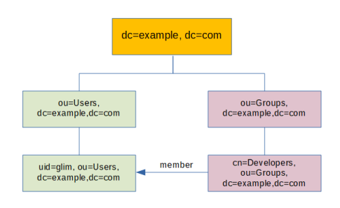

# Glim

**WORK IN PROGRESS!!**

Glim is a simple identity access management system that speaks some LDAP and is written in Go.

## Why Glim

Why not? In my case I use several tools that require a user and password to get access. Sure, we could use our Google, Twitter, Github accounts, but some of those open source tools prefer the good old LDAP protocol to authenticate, manage groups and store account information.

It's remarkable that LDAP was designed a long time ago and it's still alive and kicking. We all should develop our protocols and software in a way that they can be useful for years.

I've used LDAP servers like OpenLDAP, ApacheDS and 389DS to run my directory and used CLI or Apache Directory Studio to manage it. All of these tools are serious projects and are the best tools available when you need real LDAP servers.

The fact is that when using LDAP for authentication I've found that:

- I don't usually need all the batteries included with those LDAP servers.
- You need more time to learn how to manage and maintain those servers.
- If you want to use CLI tools, you need some time to spend learning things like LDAP schemas, LDIF (LDAP Data Interchange Format).
- It's hard to find an open source LDAP server that offers a REST API.

Finally I decided to develop my own simple identity management system that can be used with LDAP bind operations for authentication purposes and stores my team users accounts and group information. I wanted that simple server to spoke enough LDAP for my authentication purposes.

If you're looking for a full LDAP server replacement that fully understands schemas or complex search filters, please use the serious battle-tested staff, but if you want to use LDAP authentication with your applications, you want to manage your users with simple CLI commands and have a simple REST API, please try Glim and help me to improve it.

## Which applications can talk with Glim and authenticate users

I've tested Glim against the following awesome applications:

- Rancher
- Gitlab CE
- Gitea

You can find in the wiki sample configurations for all these applications. More applications to be added soon, please open an issue if you want to suggest more applications or if Glim is not working for you.

## Secured communications by design

Glim server will listen on 1323 TCP port (REST API) and on 1636 TCP (LDAPS) port and only TLS communications will be allowed in order to secure credentials and data exchange.

While I understand that you don't want to use certificates for testing, I feel that it is a good practice to use certificates from the beginning. Glim can create a fake CA and generate client and server certificates and matching private keys for testing purposes. Run the following command to create self-signed certificates for localhost and "My organization":

```(bash)
$ glim certs -o "My organization" -a "localhost,127.0.0.1"

Creating a CA certificate file and private key file...
⇨ Certificate file: root.pem
⇨ Private key file: root.key

Creating a server certificate file and private key file...
⇨ Certificate file: server.pem
⇨ Private key file: server.key

Creating a client certificate file and private key file...
⇨ Certificate file: client.pem
⇨ Private key file: client.key

Finished! All your certificates and keys should be at /tmp
```

When using the CLI a REST API will be consumed using TLS. You should use the --tlscacert flag to specify the path to your Root CA pem file or store it as ca.pem in the .glim directory at your user HOME directory. For example:

```(bash)
go run main.go user --tlscacert /tmp/root.pem
```

Failing to provide a valid CA pem file you'll receive the following error message:

```(bash)
Could not find required CA pem file to validate authority
```

## How does it work

```(bash)
glim server start --tlscert "/tmp/server.pem" --tlskey "/tmp/server.key"

glim login -u cedric.daniels -p glim.doncicuto.com

glim group add -n homicides -d "Homicides" -m jimmy.mcnulty,kima.greggs

glim user add -u lester.freamon -e lester.freamon@baltimorepolice.org -p

glim user remove -u jimmy.mcnulty

glim logout

glim server stop
```

### LDAP Tree

When I search entries in our LDAP tree, the following diagram shows how Glim works.



Users will be shown as entries under organization unit ou=Users.

Groups will be shown as entries under organization unit ou=Groups.

### Testing Glim with OpenLDAP

I can test my server using the following examples.

> Note: You must specify the location for your CA certificate so OpenLDAP can verify Glim server's certificate and the TLS handshake can run smoothly. You can use the **LDAPTLS_CACERT** environment variable.

```(bash)
$ LDAPTLS_CACERT=ca.pem ldapwhoami -x -D "cn=admin,dc=example,dc=org" -W -H ldaps://127.0.0.1:1636
Enter LDAP Password: (type the admin password and press Enter)
dn:cn=admin,dc=example,dc=org (cool this is who I am)
```

### Environment variables

- LDAP_DOMAIN: our ldap domain. Default value: example.org
- API_SERVER_ADDRESS: listen address for our REST API server. Default value: 127.0.0.1:1323
- LDAP_SERVER_ADDRESS: listen address for our LDAP server. Default value: 127.0.0.1:1636
- GLIM_URI: Glim Rest API URI (format: [https://<ip|hostname>:port](https://<ip|hostname>:port)). Default value: [https://127.0.0.1:1323](https://127.0.0.1:1323)
- BADGER_DB_PATH: Directory path for BadgerDB KV store. Default value: /tmp/kv)

### Server logging

This is a sample of a Glim server log showing REST and LDAP interaction


## Limitations / Caveats

1. You can start and stop your Glim server using `glim server [start|stop]` but if you are running Glim on a Windows machine, the stop command will fail and you will have to stop it using Ctrl+C, this is due a limitation with signal handling in Windows. In a future this behavior could be changeg if I find a workaround for prospective Windows users.

2. Glim cannot reply to Root DSE requests, so you cannot use LDAP tools like Apache Directory Studio or phpLDAPadmin to browse your directory.

3. Alias dereferencing in search requests is not supported.
