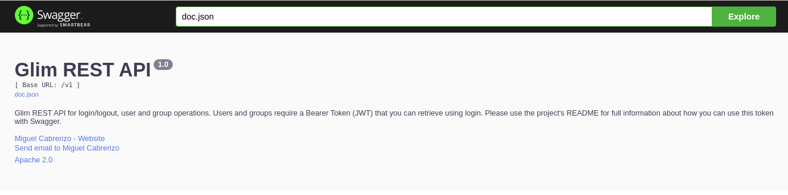
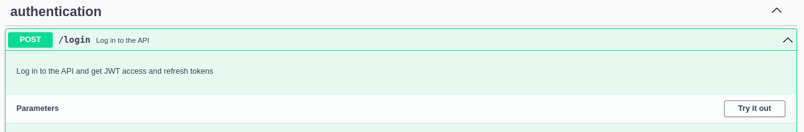
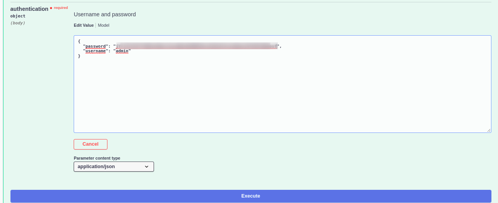
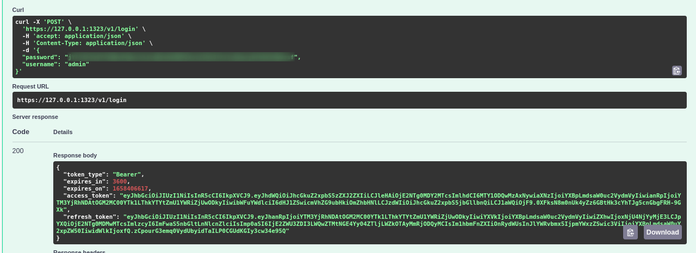
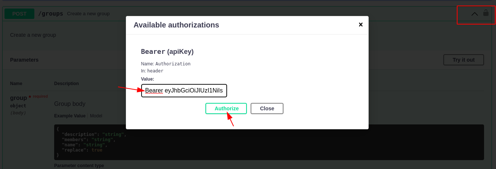
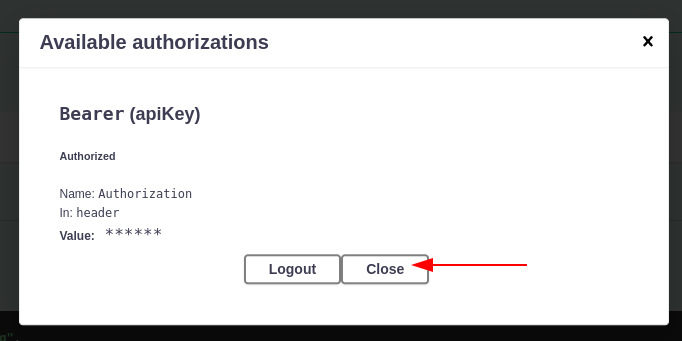
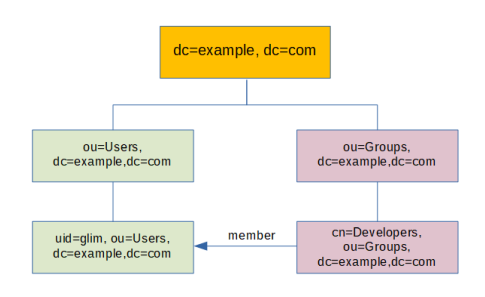
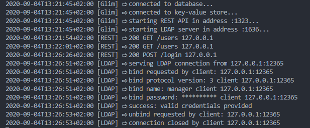

# Glim

Glim is a simple identity access management system that speaks some LDAP and is written in Go. Glim stands for Golang LDAP Identity Management 😄

## Why Glim

Why not? In my case I use several tools that require a user and password to get access. Sure, we could use our Google, Twitter, Github accounts, but some of those open source tools prefer the good old LDAP protocol to authenticate, manage groups and store account information.

It's remarkable that LDAP was designed a long time ago and it's still alive and kicking. We all should develop our protocols and software in a way that they can be useful for years.

I've used LDAP servers like OpenLDAP, ApacheDS and 389DS to run my directory and used CLI or Apache Directory Studio to manage it. All of these tools are serious projects and are the best tools available when you need real LDAP servers.

The fact is that when using LDAP for authentication I've found that:

- I don't usually need all the batteries included with those LDAP servers.
- You need more time to learn how to manage and maintain those servers.
- If you want to use CLI tools, you need some time to spend learning things like LDAP schemas or LDIF (LDAP Data Interchange Format).
- It's hard to find an open source LDAP server that offers a REST API.

Finally I decided to develop my own simple identity management system that can be used with LDAP bind operations for authentication purposes and stores my team users accounts and group information. I wanted that simple server to spoke enough LDAP for my authentication purposes.

If you're looking for a full LDAP server replacement that fully understands schemas or complex search filters, please use the serious battle-tested staff, but if you want to use LDAP authentication with your applications, you want to manage your users with simple CLI commands, have a simple REST API that you can use with your applications or use a server for your automated tests, please try Glim and help me to improve it.

## Which applications can talk with Glim and authenticate users

I've tested Glim against the following awesome applications:

- [Rancher](./docs/examples/rancher.md)
- [Gitea](./docs/examples/gitea.md)
- [Harbor](./docs/examples/harbor.md)
- [Portainer Community Edition](./docs/examples/portainer_ce.md)
- [Kanboard](./docs/examples/kanboard.md)
- [Gitlab Community Edition](./docs/examples/gitlab_ce.md)

Click on the links above for sample configurations for all these applications. More applications to be added soon, please open a discussion if you want to suggest more applications or an issue if Glim is not working for you.

## How does it work

```(bash)
$ glim server start

$ glim login -u cedric.daniels
Password: 
Login Succeeded

$ glim user

UID    USERNAME        FULLNAME             EMAIL                GROUPS               MANAGER  READONLY LOCKED  
1      admin           LDAP administrator                        none                 true     false    false   
2      search                                                    none                 false    true     false   
3      cedric.daniels  Cedric Daniels       cedric.daniels@ba... none                 true     false    false   
4      kima.greggs     Kima Greggs          kima.greggs@balti... none                 false    false    false   
5      jimmy.mcnulty   Jimmy McNulty        jimmy.mcnulty@bal... none                 false    false    false

$ glim group create -n homicides -d "Homicides" -m jimmy.mcnulty,kima.greggs,cedric.daniels
Group created

$ glim group

GID    GROUP                DESCRIPTION                         MEMBERS                                           
1      homicides            Homicides Department                cedric.daniels, kima.greggs, jimmy.mcnulty

$ glim user create -u lester.freamon -e lester.freamon@baltimorepolice.org
Password:
Confirm password:
User created

$ glim user rm -u jimmy.mcnulty
User account deleted

$ glim logout

$ glim server stop
```

## Secured communications by design

Glim server will listen on 1323 TCP port (REST API) and on 1636 TCP (LDAPS) port and only TLS communications will be allowed in order to secure credentials and data exchange.

While I understand that you don't want to use certificates for testing, I feel that it is a good practice to use certificates from the beginning. Glim can create a fake CA and generate client and server certificates and matching private keys for testing purposes.

If you start the Glim server without specifying your CA and server certificates, Glim will create a fake CA and generate certificates for your operations that will be by default at $HOME/.glim.

When using the CLI a REST API will be consumed using TLS. You should use the --tlscacert flag to specify the path to your Root CA pem file or store it as ca.pem in the .glim directory at your user HOME directory. Failing to provide a valid CA pem file you'll receive the following error message:

```(bash)
Could not find required CA pem file to validate authority
```

## Environment variables

Glim can use the following environment variables. The same variables can be set using command flags or using a configuration file.

| Variable | Required | Description | Default value if not set |
|----------|----------|-------------|--------------------------|
| GLIM_API_SECRET | Yes | A secret string to be used with JWT tokens | - |
| GLIM_ACCESS_TOKEN_EXPIRY_TIME | No | Number of seconds for access token expiration |  3600 seconds |
| GLIM_REFRESH_TOKEN_EXPIRY_TIME | No | Number of seconds for refresh token expiration | 3 days |
| GLIM_MAX_DAYS_RELOGIN | No | Number of days that we can use refresh tokens without log in again | 7 days |
| GLIM_DB_NAME | No | SQLite database file name that stores our users and groups | glim.db |
| GLIM_LDAP_DOMAIN | No | Our ldap domain | example.org |
| GLIM_REST_ADDR | No | Listen address for our REST API server | :1323 |
| GLIM_LDAP_ADDR | No | Listen address for our LDAP server | :1636 |
| GLIM_SERVER | No | Glim Rest API address for Glim commands | `https://127.0.0.1:1323` |
| GLIM_BADGERDB_STORE | No | Directory path for BadgerDB Key Value store | /tmp/kv |
| GLIM_INITIAL_ADMIN_PASSWD | No | Initial password for the admin account | - |
| GLIM_INITIAL_SEARCH_PASSWD | No | Initial password for the search account | - |

## Configuration file

Glim can use a configuration file in YAML format. You can add the configurations options line by line. Just use the name of the command flags and the value you want to use. For example:

```(yaml)
---
# Client flags
server: "https://192.168.1.136:1323"
username: "admin"

# Server flags
tlscert: /home/mcabrerizo/glim/server.pem
tlskey: /home/mcabrerizo/glim/server.key
rest-addr: "192.168.1.136:1323"
ldap-addr: "192.168.1.136:1636"
```

## REST API

Glim comes with a REST API that you can use right away using Swagger as the API documentation is accesible visiting `https://yourserver:1323/swagger/index.html`. Note: you may have to add your CA.pem file so your browser doesn't complain about security.

Here's the web page offering API documentation.



Glim uses JWT tokens to authenticate users so you'll have to request a token from the API using the /v1/login endpoint. Using Glim's Swagger server you can do it following these steps:

1. Go to the login endpoint and click on it

   

2. Click the "Try it out button". Replace "string" with your username and password to log in and click on "Execute".

   

3. If your credentials are fine and Glim's working as expected you'll see the access token that you can use in your next requests

   

4. Now you can copy that token and use it to authenticate your requests. In Swagger you can click on the padlock and a form will be offered to enter that token. Finally click on Authorize to set the authentication token.

   > ⚠️ WARNING: You'll have to put "Bearer " (that's Bearer followed by space) before the token. This is needed as Swagger 2.0 can't use JWT directly. Unfortunately the [swag](https://github.com/swaggo/swag) library used by Glim doesn't support OpenAPI 3.0, so this workaround must be used.

   

5. Once you've entered the token, click on the "Close" button. Now you'll see that the padlock icon shows a closed state and your token will be sent with your requests.

   

## Installation scenarios

### Single node scenario

Glim can run as a single instance either using its binary that you can download from the releases page or using its Docker image that can be downloaded from Docker Hub.

Glim stores your users and groups data in a SQLite database and uses [BadgerDB](https://github.com/dgraph-io/badger) as a key value storage to store API auth and refresh tokens.

### High-availability scenario - Work in progress

Glim will be able to use Postgres to store users and groups data and Redis will be used to store API auth and refresh tokens.

## LDAP Tree

When I search entries in our LDAP tree, the following diagram shows how Glim works.



Users will be shown as entries under organization unit ou=Users.

Groups will be shown as entries under organization unit ou=Groups.

## Server logging

This is a sample of a Glim server log showing REST and LDAP interaction



## Testing Glim with openLDAP client tools (ldapsearch, ldapwhoami...)

See this [page](./docs/examples/openldap.md) for examples that I used to check Glim's ability to speak LDAP.

## FAQ

1. Can I add or delete users or groups using LDIF files?

   > No. You can use Glim's CLI to manage your users and groups easier.

2. Can I use phpLDAPadmin, Apache Directory Studio or other LDAP GUI tool?

   > Not currently. Glim cannot answer Root DSE requests or add/delete LDAP operations. Open a discussion if you find this feature useful so it can be added to the roadmap.

3. Does Glim have a web user interface?

   > Not for now, but it's in the roadmap. A simple web management tool will be added thanks to Glim's REST API.

## Limitations / Caveats

1. You can start and stop your Glim server using `glim server [start|stop]` but if you are running Glim on a Windows machine, the stop command will fail and you will have to stop it using Ctrl+C, this is due a limitation with signal handling in Windows. In a future version this behavior could be changed if I find a workaround for prospective Windows users.

2. Glim cannot reply to Root DSE requests, so you cannot use LDAP tools like Apache Directory Studio or phpLDAPadmin to browse or manage your directory.

3. Alias dereferencing in search requests is not supported.
