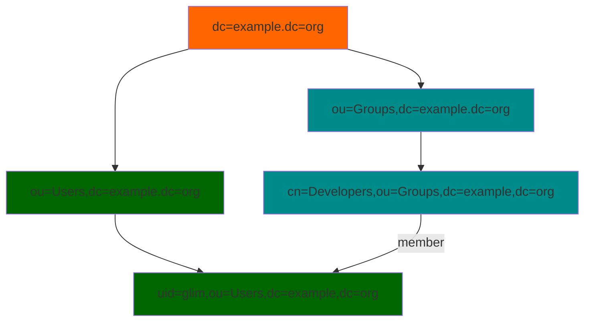

# Glim

Glim is a simple identity access management system that speaks some LDAP and is written in Go. Glim stands for Golang LDAP Identity Management 😄

## Why Glim

Why not? In my case I use several tools that require a user and password to get access. Sure, we could use our Google, Twitter, Github accounts, but some of those open source tools prefer the good old LDAP protocol to authenticate, manage groups and store account information.

It's remarkable that LDAP was designed a long time ago and it's still alive and kicking. We all should develop our protocols and software in a way that they can be useful for years.

I've used LDAP servers like OpenLDAP, ApacheDS and 389DS to run my directory and used CLI or Apache Directory Studio to manage it. All of these tools are serious projects and are the best tools available when you need real LDAP servers.

The fact is that when using LDAP for authentication I've found that:

- I don't usually need all the batteries included with those LDAP servers.
- You need more time to learn how to manage and maintain those servers.
- If you want to use CLI tools, you need some time to spend learning things like LDAP schemas or LDIF (LDAP Data Interchange Format).
- It's hard to find an open source LDAP server that offers a REST API.

Finally I decided to develop my own simple identity management system that can be used with LDAP bind operations for authentication purposes and stores my team users accounts and group information. I wanted that simple server to spoke enough LDAP for my authentication purposes.

If you're looking for a full LDAP server replacement that fully understands schemas or complex search filters, please use the serious battle-tested staff, but if you want to use LDAP authentication with your applications, you want to manage your users with simple CLI commands, have a simple REST API that you can use with your applications or use a server for your automated tests, please try Glim and help me to improve it.

## Which applications can talk with Glim and authenticate users

I've tested Glim against the following awesome applications:

- [Rancher](./docs/examples/rancher.md)
- [Gitea](./docs/examples/gitea.md)
- [Harbor](./docs/examples/harbor.md)
- [Portainer Community Edition](./docs/examples/portainer_ce.md)
- [Kanboard](./docs/examples/kanboard.md)
- [Gitlab Community Edition](./docs/examples/gitlab_ce.md)

Click on the links above for sample configurations for all these applications. More applications to be added soon, please open a discussion if you want to suggest more applications or an issue if Glim is not working for you.

## How does it work

```(bash)
$ GLIM_API_SECRET="mysecret" glim server start

$ glim login -u cedric.daniels
Password: 
Login Succeeded

$ glim user

UID    USERNAME        FULLNAME             EMAIL                GROUPS               MANAGER  READONLY LOCKED  
1      admin           LDAP administrator                        none                 true     false    false   
2      search                                                    none                 false    true     false   
3      cedric.daniels  Cedric Daniels       cedric.daniels@ba... none                 true     false    false   
4      kima.greggs     Kima Greggs          kima.greggs@balti... none                 false    false    false   
5      jimmy.mcnulty   Jimmy McNulty        jimmy.mcnulty@bal... none                 false    false    false

$ glim group create -n homicides -d "Homicides" -m jimmy.mcnulty,kima.greggs,cedric.daniels
Group created

$ glim group

GID    GROUP                DESCRIPTION                         MEMBERS                                           
1      homicides            Homicides Department                cedric.daniels, kima.greggs, jimmy.mcnulty

$ glim user create -u lester.freamon -e lester.freamon@baltimorepolice.org
Password:
Confirm password:
User created

$ glim user rm -u jimmy.mcnulty
User account deleted

$ LDAPTLS_CACERT=/home/cedric/.glim/ca.pem ldapwhoami -x -D "cn=admin,dc=example,dc=org" -W -H ldaps://127.0.0.1:1636
Enter LDAP Password:
dn:cn=admin,dc=example,dc=org 

$ glim logout

$ glim server stop
```

## Using the Docker image

Glim images are published in Docker Hub at [https://hub.docker.com/r/sologitops/glim](https://hub.docker.com/r/sologitops/glim)

Before you run Glim with Docker create a directory that will store self-signed certificates and user database.

For example:

```(bash)
mkdir /tmp/glim`
```

You can run a server using the following command:

```(bash)
docker run -e GLIM_API_SECRET="yourapisecret" -v /tmp/glim:/home/glim/.glim  --name glim -p 1323:1323 -p 1636:1636 -d sologitops/glim`
```

You'll find some interesting files in our mounted directory. Our fake CA private key and public certificate, our Glim server certificate and private key and a client certificate and key that can be used to query our server. Also we'll find the glim SQLite database file, glim.db.

Note that we've published 1323 and 1636 ports. Thanks to these published ports, Glim REST and LDAP servers will listen on ports 1323 and 1636 for localhost.

```(bash)
-rw-------  1 sologitops sologitops   227 sep  2 19:37 ca.key
-rw-r--r--  1 sologitops sologitops   607 sep  2 19:37 ca.pem
-rw-------  1 sologitops sologitops   227 sep  2 19:37 client.key
-rw-r--r--  1 sologitops sologitops   603 sep  2 19:37 client.pem
-rw-r--r--  1 sologitops sologitops 36864 sep  2 19:37 glim.db
-rw-------  1 sologitops sologitops   227 sep  2 19:37 server.key
-rw-r--r--  1 sologitops sologitops   607 sep  2 19:37 server.pem
```

If you want to know the default passwords for your admin and search users, you can use docker logs to find them:

```(bash)
docker logs -f glim
```

```(bash)
...
------------------------------------- WARNING -------------------------------------
A new user with manager permissions has been created:
- Username: admin
- Password Dg9FXUkrs6aOTqhMkKLW3ESvmsQvS4Bm6g12WAamQ9cbzRfxEdxpL7NEsOlyZax2
Please store or write down this password to manage Glim.
You can delete this user once you assign manager permissions to another user
-----------------------------------------------------------------------------------

------------------------------------- WARNING -------------------------------------
A new user with read-only permissions has been created:
- Username: search
- Password WgkJeRgAuRzdPncgj50f9TXAtN9NbGiAqDn8pRvlxW7vJetGeSy4zf2aMTEc1X4G
Please store or write down this password to perform search queries in Glim.
-----------------------------------------------------------------------------------
```

Now, that we have a Glim server we can run Glim's CLI using a container. Before we can run our commands against our server, we must log in first and use a client certificate. For an easier use we'll use the directory that we created earlier to get access to our client certificate and to store the token needed to perform our operations against a Glim server. Also, we'll use the same network used by the glim container so every command runs as we were using localhost.

```(bash)
docker run -v /tmp/glim:/home/glim/.glim --rm -it --network container:glim sologitops/glim login
Username: admin
Password: 
Login Succeeded

docker run -v /tmp/glim:/home/glim/.glim --rm -it --network container:glim sologitops/glim user
UID    USERNAME        FULLNAME             EMAIL                GROUPS               MANAGER  READONLY LOCKED  
1      admin           LDAP administrator                        none                 true     false    false   
2      search          Read-Only Account                         none                 false    true     false 

docker run -v /tmp/glim:/home/glim/.glim --rm -it --network container:glim sologitops/glim group create -g devel -d "Developers"
Group created
```

Now, if we want to use Glim to answer LDAP queries we'll specify our CA certificate for TLS communications and set our host (127.0.0.1) and port (1636). For example, I'll run an ldapwhoami command:

```(bash)
LDAPTLS_CACERT=/tmp/glim/ca.pem ldapwhoami -x -D "cn=admin,dc=example,dc=org" -W -H ldaps://127.0.0.1:1636
Enter LDAP Password: 
dn:cn=admin,dc=example,dc=org
```

Once we are finished with our Glim server we can stop it and remove it

```(bash)
docker stop glim
docker rm glim
```

## Glim - Create or remove users using CSV files

You can create users from a CSV file for easier management.

```bash
glim csv users create -f /tmp/test.csv 
```

If you want to create users you must use a CSV file with the following header row:

```bash
username,firstname,lastname,email,password,ssh_public_key,manager,readonly,locked,groups
```

Then add a row for each user that you want to create

```bash
username,firstname,lastname,email,password,ssh_public_key,manager,readonly,locked,groups
"gumball","Gumball","Watterson","gumbal@example.org","test","",true,false,false,"devel"
"anais","Anais","Watterson","anais@example.org",,,false,false,false,"devel,gitea-admins"
```

Don't use spaces before or after commas. You can set boolean values without quotes. Remember that you can use a string with group names separated by commas to set memberships. Use blanks between commas if you don't want to set those fields.

If you want to remove users, use a file like the following example. If you want to specify the user id use a number, if you only want to use the username set it between double quotes and set 0 as the user id.

```bash
uid, username
0,"gumbal"
7,""
```

## Glim user types (roles)

Glim has the following roles:

- Manager. Can create, update and delete users and/or groups and set group memberships.
- Plain users. A plain user can get its user account information, update its name, email, ssh public key and password. A plain user can change its role and its memberships.
- Read-only. Can read users and groups information.

Glim will create and admin user (manager) and a search user (readonly) to start managing your database.

## Secured communications by design

Glim server will listen on 1323 TCP port (REST API) and on 1636 TCP (LDAPS) port and only TLS communications will be allowed in order to secure credentials and data exchange.

While I understand that you don't want to use certificates for testing, I feel that it is a good practice to use certificates from the beginning. Glim can create a fake CA and generate client and server certificates and matching private keys for testing purposes.

If you start the Glim server without specifying your CA and server certificates, Glim will create a fake CA and generate certificates for your operations that will be by default at $HOME/.glim.

When using the CLI a REST API will be consumed using TLS. You should use the --tlscacert flag to specify the path to your Root CA pem file or store it as ca.pem in the .glim directory at your user HOME directory. Failing to provide a valid CA pem file you'll receive the following error message:

```(bash)
Could not find required CA pem file to validate authority
```

## Environment variables

Glim can use the following environment variables. The same variables can be set using command flags or using a configuration file.

| Variable | Required | Description | Default value if not set |
|----------|----------|-------------|--------------------------|
| GLIM_API_SECRET | Yes | A secret string to be used with JWT tokens | - |
| GLIM_ACCESS_TOKEN_EXPIRY_TIME | No | Number of seconds for access token expiration |  3600 seconds |
| GLIM_REFRESH_TOKEN_EXPIRY_TIME | No | Number of seconds for refresh token expiration | 3 days |
| GLIM_MAX_DAYS_RELOGIN | No | Number of days that we can use refresh tokens without log in again | 7 days |
| GLIM_DB_NAME | No | SQLite database file name that stores our users and groups | glim.db |
| GLIM_LDAP_DOMAIN | No | Our ldap domain | example.org |
| GLIM_REST_ADDR | No | Listen address for our REST API server | :1323 |
| GLIM_LDAP_ADDR | No | Listen address for our LDAP server | :1636 |
| GLIM_LDAP_SIZE_LIMIT | No | Max number of entries that should be returned from a search | 500 |
| GLIM_SERVER | No | Glim Rest API address for Glim commands | `https://127.0.0.1:1323` |
| GLIM_BADGERDB_STORE | No | Directory path for BadgerDB Key Value store | /tmp/kv |
| GLIM_INITIAL_ADMIN_PASSWD | No | Initial password for the admin account | - |
| GLIM_INITIAL_SEARCH_PASSWD | No | Initial password for the search account | - |
| GLIM_INITIAL_USERS | No | Users that will be added to Glim when server starts | - |
| GLIM_INITIAL_USERS_PASSWORD | No | Password for initial users | glim |

## Configuration file

Glim can use a configuration file in YAML format. You can add the configurations options line by line. Just use the name of the command flags and the value you want to use. For example:

```(yaml)
---
# Client flags
server: "https://192.168.1.136:1323"
username: "admin"

# Server flags
tlscert: /home/sologitops/glim/server.pem
tlskey: /home/sologitops/glim/server.key
rest-addr: "192.168.1.136:1323"
ldap-addr: "192.168.1.136:1636"
```

## REST API

Glim comes with a [REST API](/docs/rest.md),that you can use right away using Swagger.

## Installation scenarios

### Single node scenario

Glim can run as a single instance either using its binary that you can download from the releases page or using its Docker image that can be downloaded from Docker Hub.

Glim stores your users and groups data in a SQLite database and uses [BadgerDB](https://github.com/dgraph-io/badger) as a key value storage to store API auth and refresh tokens.

### High-availability scenario - Work in progress

Glim will be able to use Postgres to store users and groups data and Redis will be used to store API auth and refresh tokens.

## LDAP Tree

When I search entries in our LDAP tree, the following diagram shows how Glim works.



Users will be shown as entries under organization unit ou=Users.

Groups will be shown as entries under organization unit ou=Groups.

## Server logging

This is a sample of a Glim server log showing REST and LDAP interaction

```(bash)
2022-09-03T09:12:47+02:00 [Glim] ⇨ connected to database...
2022-09-03T09:12:47+02:00 [Glim] ⇨ connected to key-value store...
2022-09-03T09:12:47+02:00 [Glim] ⇨ starting REST API in address :1323...
2022-09-03T09:12:47+02:00 [Glim] ⇨ starting LDAPS server in address :1636...
2022-09-03T09:12:57+02:00 [REST] ⇨ 200 POST /v1/login/refresh_token 127.0.0.1 
2022-09-03T09:12:57+02:00 [REST] ⇨ 200 GET /v1/users 127.0.0.1 
2022-09-03T09:13:04+02:00 [REST] ⇨ 200 POST /v1/login 127.0.0.1 
2022-09-03T09:13:08+02:00 [REST] ⇨ 200 GET /v1/groups 127.0.0.1 
2022-09-03T09:13:22+02:00 [REST] ⇨ 200 GET /v1/users/5 127.0.0.1 
2022-09-03T09:13:37+02:00 [LDAP] ⇨ serving LDAPS connection from 127.0.0.1:37100
2022-09-03T09:13:37+02:00 [LDAP] ⇨ connection closed by client 127.0.0.1:37100
2022-09-03T09:14:13+02:00 [LDAP] ⇨ serving LDAPS connection from 127.0.0.1:58564
2022-09-03T09:14:13+02:00 [LDAP] ⇨ bind requested by client: 127.0.0.1:58564
2022-09-03T09:14:13+02:00 [LDAP] ⇨ bind protocol version: 3 client 127.0.0.1:58564
2022-09-03T09:14:13+02:00 [LDAP] ⇨ bind name: cn=admin,dc=example,dc=org client 127.0.0.1:58564
2022-09-03T09:14:13+02:00 [LDAP] ⇨ bind password: ********** client 127.0.0.1:58564
2022-09-03T09:14:13+02:00 [LDAP] ⇨ success: valid credentials provided
2022-09-03T09:14:13+02:00 [LDAP] ⇨ whoami requested by client
2022-09-03T09:14:13+02:00 [LDAP] ⇨ whoami response: dn:cn=admin,dc=example,dc=org
2022-09-03T09:14:13+02:00 [LDAP] ⇨ unbind requested by client: 127.0.0.1:58564
2022-09-03T09:14:13+02:00 [LDAP] ⇨ connection closed by client 127.0.0.1:58564
2022-09-03T09:14:46+02:00 [LDAP] ⇨ serving LDAPS connection from 192.168.1.136:41610
2022-09-03T09:14:46+02:00 [LDAP] ⇨ bind requested by client: 192.168.1.136:41610
2022-09-03T09:14:46+02:00 [LDAP] ⇨ bind protocol version: 3 client 192.168.1.136:41610
2022-09-03T09:14:46+02:00 [LDAP] ⇨ bind name: cn=search,dc=example,dc=org client 192.168.1.136:41610
2022-09-03T09:14:46+02:00 [LDAP] ⇨ bind password: ********** client 192.168.1.136:41610
2022-09-03T09:14:46+02:00 [LDAP] ⇨ success: valid credentials provided
2022-09-03T09:14:46+02:00 [LDAP] ⇨ search requested by client 192.168.1.136:41610
2022-09-03T09:14:46+02:00 [LDAP] ⇨ search base object: cn=devel,ou=Groups,dc=example,dc=org
2022-09-03T09:14:46+02:00 [LDAP] ⇨ search scope: wholeSubtree
2022-09-03T09:14:46+02:00 [LDAP] ⇨ search maximum number of entries to be returned (0 - No limit restriction): 0
2022-09-03T09:14:46+02:00 [LDAP] ⇨ search maximum time limit (0 - No limit restriction): 0
2022-09-03T09:14:46+02:00 [LDAP] ⇨ search show types only: false
2022-09-03T09:14:46+02:00 [LDAP] ⇨ search filter: (&(objectClass=groupOfNames)(uid=*))
2022-09-03T09:14:46+02:00 [LDAP] ⇨ search attributes: uid
2022-09-03T09:14:46+02:00 [LDAP] ⇨ unbind requested by client: 192.168.1.136:41610
2022-09-03T09:14:46+02:00 [LDAP] ⇨ connection closed by client 192.168.1.136:41610
```

## Testing Glim with openLDAP client tools (ldapsearch, ldapwhoami...)

See this [page](./docs/examples/openldap.md) for examples that I used to check Glim's ability to speak LDAP.

## FAQ

1. Can I add or delete users or groups using LDIF files?

   > No. You can use Glim's CLI to manage your users and groups easier.

2. Can I use phpLDAPadmin, Apache Directory Studio or other LDAP GUI tool?

   > Not currently. Glim cannot answer Root DSE requests or add/delete LDAP operations. Open a discussion if you find this feature useful so it can be added to the roadmap.

3. Does Glim have a web user interface?

   > Not for now, but it's in the roadmap. A simple web management tool will be added thanks to Glim's REST API.

## Limitations / Caveats

1. You can start and stop your Glim server using `glim server [start|stop]` but if you are running Glim on a Windows machine, the stop command will fail and you will have to stop it using Ctrl+C, this is due a limitation with signal handling in Windows. In a future version this behavior could be changed if I find a workaround for prospective Windows users.

2. Glim cannot reply to Root DSE requests, so you cannot use LDAP tools like Apache Directory Studio or phpLDAPadmin to browse or manage your directory.

3. Alias dereferencing in search requests is not supported.

### Acknowledgments

Many thanks to @johnweldon and all the contributors for [https://github.com/go-asn1-ber/asn1-ber](https://github.com/go-asn1-ber/asn1-ber).

Also, many thanks to @labstack for the [Echo framework](https://github.com/labstack/echo).
