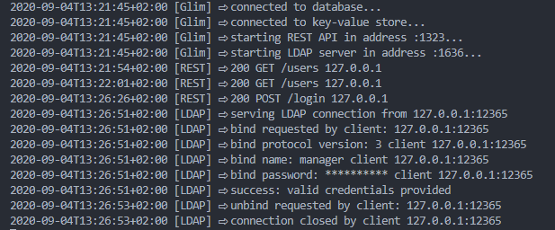

# Glim

**WORK IN PROGRESS!!**

Glim is a simple identity access management system that speaks some LDAP and is written in Go.

## Why Glim

In Muultipla we use several tools that require a user and password to get access. Sure, we could use our Google, Twitter, Github accounts, but some of those open source tools prefer the good old LDAP protocol to authenticate, manage groups and store account information.

It's remarkable that LDAP was designed a long time ago and it's still alive and kicking. We all should develop our protocols and software in a way that they can be useful for years.

We've used LDAP servers like OpenLDAP, ApacheDS and 389DS and you also have FreeIPA. All of them are serious projects and the best tools available when you need real LDAP servers.

The fact is that when using LDAP for authentication we've found that:

- We don't usually need all the batteries included with those LDAP servers.
- You need some time to spend learning things like LDAP schemas, LDIF (LDAP Data Interchange Format).
- You need more time to learn how to manage and maintain those servers.
- We all love to learn new stuff, don't we? but in the end you may say "I just want to store a username, a password and some more information, do I need all these ancient information about ASN.1?"
- Sometimes you want to test your LDAP authenticated applications and you'd like to create some users quickly.
- You may like to have a server which is ready to run in your private Kubernetes cluster.

Finally we decided to develop our own simple identity management system that can be used with LDAP bind operations for authentication purposes and stores our team users accounts and group information. We wanted to have a simple server that spoke enough LDAP for our purposes.

If you're looking for a full LDAP server replacement that understands funny schemas or complex search filters, please use the serious battle-tested staff, but if you want to use LDAP authentication with your web applications, please try our server.

## Secured communications by design

Glim server will listen on 1323 TCP port (REST API) 1636 TCP (LDAPS) port and only TLS communications will be allowed in order to secure credentials and data exchange.

While we understand that you don't want to use certificates for testing, we feel that it is a good practice to use certificates from the beginning. Glim can create a fake CA and generate client and server certificates and matching private keys for testing purposes. Run the following command to create self-signed certificates for localhost and "My organization":

```(bash)
$ glim certs -o "My organization" -a "localhost,127.0.0.1"

Creating a CA certificate file and private key file...
⇨ Certificate file: root.pem
⇨ Private key file: root.key

Creating a server certificate file and private key file...
⇨ Certificate file: server.pem
⇨ Private key file: server.key

Creating a client certificate file and private key file...
⇨ Certificate file: client.pem
⇨ Private key file: client.key

Finished! All your certificates and keys should be at /tmp
```

## How does it work

```(bash)
glim server start --tlscert "/tmp/server.pem" --tlskey "/tmp/server.key"

glim login -u cedric.daniels -p glim.muultipla.com

glim group add devops

glim account add -u lester.freamon -e lester.freamon@baltimorepolice.org -g devops,support -p
glim account remove -u jimmy.mcnulty

glim logout

$ glim server stop
```

### Testing Glim with OpenLDAP

We can test our server using the following examples.

> Note: we must specify the location for our CA certificate so OpenLDAP can verify Glim server's certificate and the TLS handshake can run smoothly. We use the **LDAPTLS_CACERT** environment variable.

```(bash)
$ LDAPTLS_CACERT=ca.pem ldapwhoami -x -D "cn=manager,dc=example,dc=com" -W -H ldaps://127.0.0.1:1636
Enter LDAP Password: (type the manager password and press Enter)
dn:cn=manager,dc=example,dc=org (cool this is who I am)
```

### Server logging

This is a sample of a Glim server log showing REST and LDAP interaction


