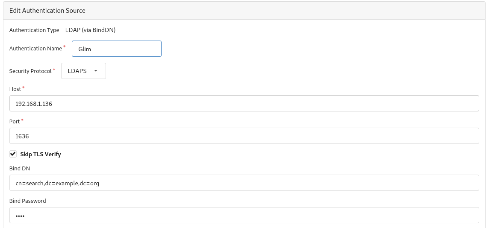
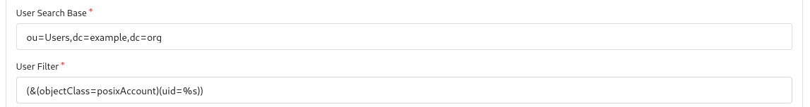
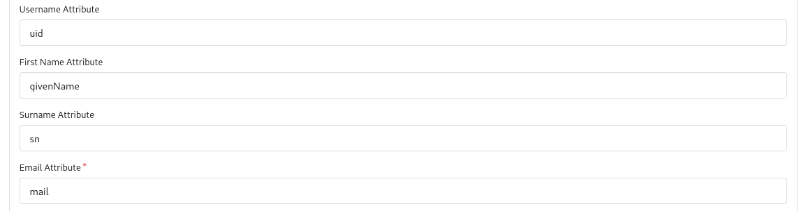

# Gitea - LDAP via BindDN

This page shows how you can configure Gitea to authenticate users with Glim using BindDN. [Gitea documentation](https://docs.gitea.io/en-us/authentication/) explains in detail what is needed to use LDAP but here we offer a full example with our suggestions.

First we'll create a Glim account with read-only privilege so it can be used for looking up users. We'll use this account and the password we set in the Bind DN input and Bind Password fields.

```(bash)
$ glim user --tlscacert ~/glim/ca.pem --server https://ldap.sologitops.com:1323 create -u search -f Search -l User -e test@sologitops.com --readonly
Password: 
Confirm password: 
User created
```

Also we'll create a Glim group for those users that we want them to be administrators in Gitea. For example mcabrerizo we'll be one of those administrators:

```(bash)
$ glim group --tlscacert ~/glim/ca.pem --server https://ldap.sologitops.com:1323 create -d "Gitea Admins" -n gitea-admins -m mcabrerizo
Group created
```

> Unfortunately Gitea doesn't offer an easy way to add our custom root CA (discussed [here](https://github.com/go-gitea/gitea/issues/14102)) so please check **Skip TLS verify**.



We'll use the following settings for User search:



Gitea will filter administrator users using the group that we created earlier with Glim (gitea-admins):


We want Gitea to show our first name, surname, email and use our Glim usernames so we'll use the following settings for this purpose:



Sample log showing successful authentication, user information retrieval, getting groups...:

```(text)
2022-06-25T12:39:51+02:00 [LDAP] ⇨ serving LDAPS connection from 172.21.0.2:48456
2022-06-25T12:39:51+02:00 [LDAP] ⇨ bind requested by client: 172.21.0.2:48456
2022-06-25T12:39:51+02:00 [LDAP] ⇨ bind protocol version: 3 client 172.21.0.2:48456
2022-06-25T12:39:51+02:00 [LDAP] ⇨ bind name: cn=search,dc=example,dc=org client 172.21.0.2:48456
2022-06-25T12:39:51+02:00 [LDAP] ⇨ bind password: ********** client 172.21.0.2:48456
2022-06-25T12:39:51+02:00 [LDAP] ⇨ success: valid credentials provided
2022-06-25T12:39:51+02:00 [LDAP] ⇨ search requested by client 172.21.0.2:48456
2022-06-25T12:39:51+02:00 [LDAP] ⇨ search base object: ou=Users,dc=example,dc=org
2022-06-25T12:39:51+02:00 [LDAP] ⇨ search scope: wholeSubtree
2022-06-25T12:39:51+02:00 [LDAP] ⇨ search maximum number of entries to be returned (0 - No limit restriction): 0
2022-06-25T12:39:51+02:00 [LDAP] ⇨ search maximum time limit (0 - No limit restriction): 0
2022-06-25T12:39:51+02:00 [LDAP] ⇨ search show types only: false
2022-06-25T12:39:51+02:00 [LDAP] ⇨ search filter: (&(objectClass=posixAccount)(uid=mcabrerizo))
2022-06-25T12:39:51+02:00 [LDAP] ⇨ search attributes: ALL
2022-06-25T12:39:51+02:00 [LDAP] ⇨ bind requested by client: 172.21.0.2:48456
2022-06-25T12:39:51+02:00 [LDAP] ⇨ bind protocol version: 3 client 172.21.0.2:48456
2022-06-25T12:39:51+02:00 [LDAP] ⇨ bind name: uid=mcabrerizo,ou=Users,dc=example,dc=org client 172.21.0.2:48456
2022-06-25T12:39:51+02:00 [LDAP] ⇨ bind password: ********** client 172.21.0.2:48456
2022-06-25T12:39:51+02:00 [LDAP] ⇨ success: valid credentials provided
2022-06-25T12:39:51+02:00 [LDAP] ⇨ search requested by client 172.21.0.2:48456
2022-06-25T12:39:51+02:00 [LDAP] ⇨ search base object: uid=mcabrerizo,ou=Users,dc=example,dc=org
2022-06-25T12:39:51+02:00 [LDAP] ⇨ search scope: wholeSubtree
2022-06-25T12:39:51+02:00 [LDAP] ⇨ search maximum number of entries to be returned (0 - No limit restriction): 0
2022-06-25T12:39:51+02:00 [LDAP] ⇨ search maximum time limit (0 - No limit restriction): 0
2022-06-25T12:39:51+02:00 [LDAP] ⇨ search show types only: false
2022-06-25T12:39:51+02:00 [LDAP] ⇨ search filter: (&(objectClass=posixAccount)(uid=mcabrerizo))
2022-06-25T12:39:51+02:00 [LDAP] ⇨ search attributes: uid givenName sn mail
2022-06-25T12:39:51+02:00 [LDAP] ⇨ search requested by client 172.21.0.2:48456
2022-06-25T12:39:51+02:00 [LDAP] ⇨ search base object: uid=mcabrerizo,ou=Users,dc=example,dc=org
2022-06-25T12:39:51+02:00 [LDAP] ⇨ search scope: wholeSubtree
2022-06-25T12:39:51+02:00 [LDAP] ⇨ search maximum number of entries to be returned (0 - No limit restriction): 0
2022-06-25T12:39:51+02:00 [LDAP] ⇨ search maximum time limit (0 - No limit restriction): 0
2022-06-25T12:39:51+02:00 [LDAP] ⇨ search show types only: false
2022-06-25T12:39:51+02:00 [LDAP] ⇨ search filter: (memberOf=cn=gitea-admins,ou=Groups,dc=example,dc=org)
2022-06-25T12:39:51+02:00 [LDAP] ⇨ search attributes: givenName
2022-06-25T12:39:51+02:00 [LDAP] ⇨ connection closed by client 172.21.0.2:48456

```
