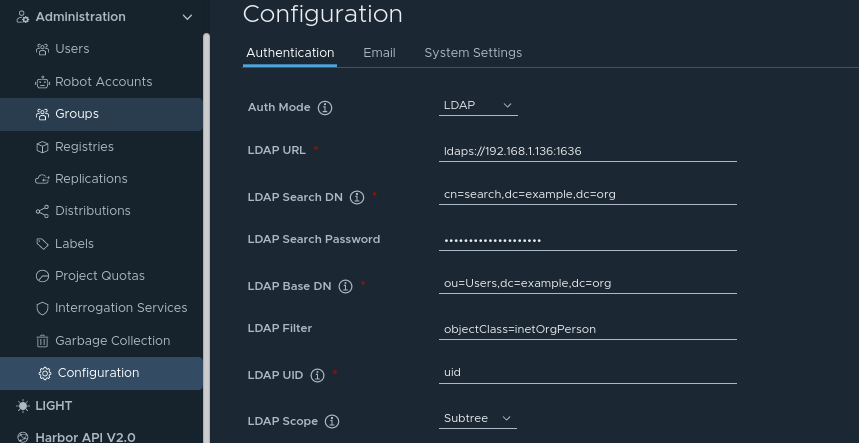
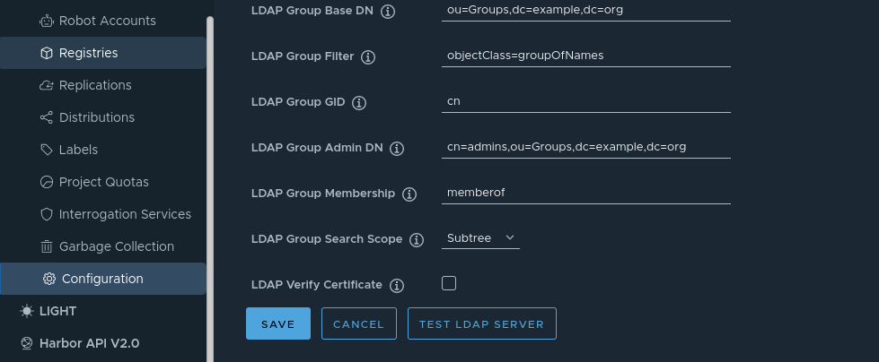

# Harbor

This page shows how you can configure Harbor to authenticate users with Glim. [Harbor documentation](https://goharbor.io/docs/1.10/administration/configure-authentication/ldap-auth/) explains you how to configure Harbor to use LDAP. Here we offer a full example with our suggestions to use Glim as an LDAP server.

First we'll visit the Administration -> Configuration menu in Harbor and click on LDAP (Auth mode= to configure our LDAP server. We'll set our server address, our search dn and password and the following settings for user search.



We've added an admin group that will be used to set which Glim users will have admin privileges. As usual we'll add our Groups configuration to harbor.



In this example we haven't configured Harbor to use our CA certificate so we'll uncheck "LDAP Verify Certificate". Finally we'll test our LDAP connection.


Sample log showing successful authentication, user information retrieval, getting groups...:

```(bash)
2022-07-05T18:40:38+02:00 [LDAP] ⇨ serving LDAPS connection from 172.22.0.10:49816
2022-07-05T18:40:38+02:00 [LDAP] ⇨ bind requested by client: 172.22.0.10:49816
2022-07-05T18:40:38+02:00 [LDAP] ⇨ bind protocol version: 3 client 172.22.0.10:49816
2022-07-05T18:40:38+02:00 [LDAP] ⇨ bind name: cn=search,dc=example,dc=org client 172.22.0.10:49816
2022-07-05T18:40:38+02:00 [LDAP] ⇨ bind password: ********** client 172.22.0.10:49816
2022-07-05T18:40:38+02:00 [LDAP] ⇨ success: valid credentials provided
2022-07-05T18:40:38+02:00 [LDAP] ⇨ search requested by client 172.22.0.10:49816
2022-07-05T18:40:38+02:00 [LDAP] ⇨ search base object: ou=Users,dc=example,dc=org
2022-07-05T18:40:38+02:00 [LDAP] ⇨ search scope: wholeSubtree
2022-07-05T18:40:38+02:00 [LDAP] ⇨ search maximum number of entries to be returned (0 - No limit restriction): 0
2022-07-05T18:40:38+02:00 [LDAP] ⇨ search maximum time limit (0 - No limit restriction): 0
2022-07-05T18:40:38+02:00 [LDAP] ⇨ search show types only: false
2022-07-05T18:40:38+02:00 [LDAP] ⇨ search filter: (&(objectClass=inetOrgPerson)(uid=mcabrerizo))
2022-07-05T18:40:38+02:00 [LDAP] ⇨ search attributes: uid cn mail email memberof
2022-07-05T18:40:38+02:00 [LDAP] ⇨ bind requested by client: 172.22.0.10:49816
2022-07-05T18:40:38+02:00 [LDAP] ⇨ bind protocol version: 3 client 172.22.0.10:49816
2022-07-05T18:40:38+02:00 [LDAP] ⇨ bind name: uid=mcabrerizo,ou=Users,dc=example,dc=org client 172.22.0.10:49816
2022-07-05T18:40:38+02:00 [LDAP] ⇨ bind password: ********** client 172.22.0.10:49816
2022-07-05T18:40:38+02:00 [LDAP] ⇨ success: valid credentials provided
2022-07-05T18:40:38+02:00 [LDAP] ⇨ bind requested by client: 172.22.0.10:49816
2022-07-05T18:40:38+02:00 [LDAP] ⇨ bind protocol version: 3 client 172.22.0.10:49816
2022-07-05T18:40:38+02:00 [LDAP] ⇨ bind name: cn=search,dc=example,dc=org client 172.22.0.10:49816
2022-07-05T18:40:38+02:00 [LDAP] ⇨ bind password: ********** client 172.22.0.10:49816
2022-07-05T18:40:38+02:00 [LDAP] ⇨ success: valid credentials provided
2022-07-05T18:40:38+02:00 [LDAP] ⇨ search requested by client 172.22.0.10:49816
2022-07-05T18:40:38+02:00 [LDAP] ⇨ search base object: cn=devel,ou=Groups,dc=example,dc=org
2022-07-05T18:40:38+02:00 [LDAP] ⇨ search scope: wholeSubtree
2022-07-05T18:40:38+02:00 [LDAP] ⇨ search maximum number of entries to be returned (0 - No limit restriction): 0
2022-07-05T18:40:38+02:00 [LDAP] ⇨ search maximum time limit (0 - No limit restriction): 0
2022-07-05T18:40:38+02:00 [LDAP] ⇨ search show types only: false
2022-07-05T18:40:38+02:00 [LDAP] ⇨ search filter: (&(objectClass=groupOfNames)(uid=*))
2022-07-05T18:40:38+02:00 [LDAP] ⇨ search attributes: uid
2022-07-05T18:40:38+02:00 [LDAP] ⇨ bind requested by client: 172.22.0.10:49816
2022-07-05T18:40:38+02:00 [LDAP] ⇨ bind protocol version: 3 client 172.22.0.10:49816
2022-07-05T18:40:38+02:00 [LDAP] ⇨ bind name: cn=search,dc=example,dc=org client 172.22.0.10:49816
2022-07-05T18:40:38+02:00 [LDAP] ⇨ bind password: ********** client 172.22.0.10:49816
2022-07-05T18:40:38+02:00 [LDAP] ⇨ success: valid credentials provided
2022-07-05T18:40:38+02:00 [LDAP] ⇨ search requested by client 172.22.0.10:49816
2022-07-05T18:40:38+02:00 [LDAP] ⇨ search base object: cn=gitea-admins,ou=Groups,dc=example,dc=org
2022-07-05T18:40:38+02:00 [LDAP] ⇨ search scope: wholeSubtree
2022-07-05T18:40:38+02:00 [LDAP] ⇨ search maximum number of entries to be returned (0 - No limit restriction): 0
2022-07-05T18:40:38+02:00 [LDAP] ⇨ search maximum time limit (0 - No limit restriction): 0
2022-07-05T18:40:38+02:00 [LDAP] ⇨ search show types only: false
2022-07-05T18:40:38+02:00 [LDAP] ⇨ search filter: (&(objectClass=groupOfNames)(uid=*))
2022-07-05T18:40:38+02:00 [LDAP] ⇨ search attributes: uid
2022-07-05T18:40:38+02:00 [LDAP] ⇨ bind requested by client: 172.22.0.10:49816
2022-07-05T18:40:38+02:00 [LDAP] ⇨ bind protocol version: 3 client 172.22.0.10:49816
2022-07-05T18:40:38+02:00 [LDAP] ⇨ bind name: cn=search,dc=example,dc=org client 172.22.0.10:49816
2022-07-05T18:40:38+02:00 [LDAP] ⇨ bind password: ********** client 172.22.0.10:49816
2022-07-05T18:40:38+02:00 [LDAP] ⇨ success: valid credentials provided
2022-07-05T18:40:38+02:00 [LDAP] ⇨ search requested by client 172.22.0.10:49816
2022-07-05T18:40:38+02:00 [LDAP] ⇨ search base object: cn=admins,ou=Groups,dc=example,dc=org
2022-07-05T18:40:38+02:00 [LDAP] ⇨ search scope: wholeSubtree
2022-07-05T18:40:38+02:00 [LDAP] ⇨ search maximum number of entries to be returned (0 - No limit restriction): 0
2022-07-05T18:40:38+02:00 [LDAP] ⇨ search maximum time limit (0 - No limit restriction): 0
2022-07-05T18:40:38+02:00 [LDAP] ⇨ search show types only: false
2022-07-05T18:40:38+02:00 [LDAP] ⇨ search filter: (&(objectClass=groupOfNames)(uid=*))
2022-07-05T18:40:38+02:00 [LDAP] ⇨ search attributes: uid
2022-07-05T18:40:38+02:00 [LDAP] ⇨ connection closed by client 172.22.0.10:49816
```