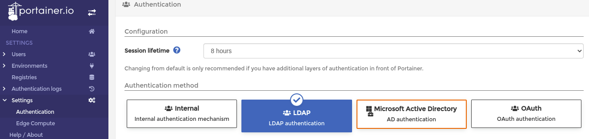
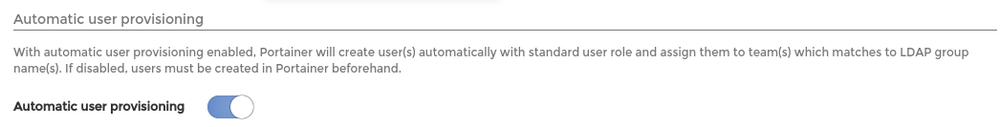
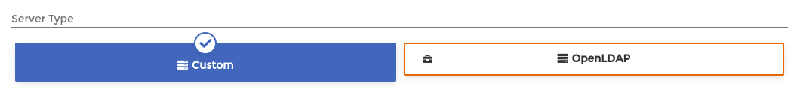
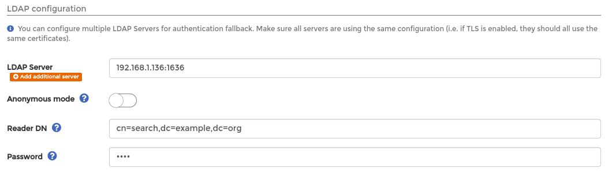
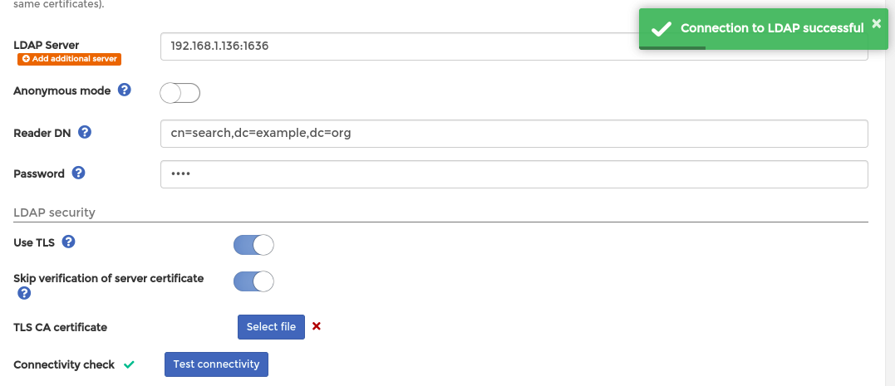
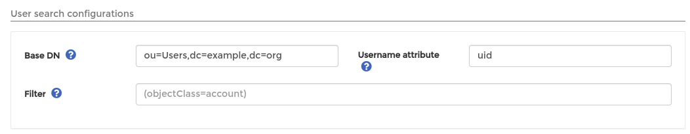
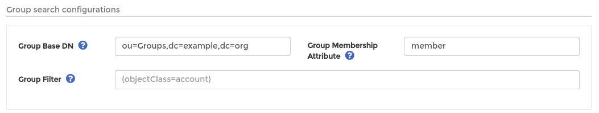
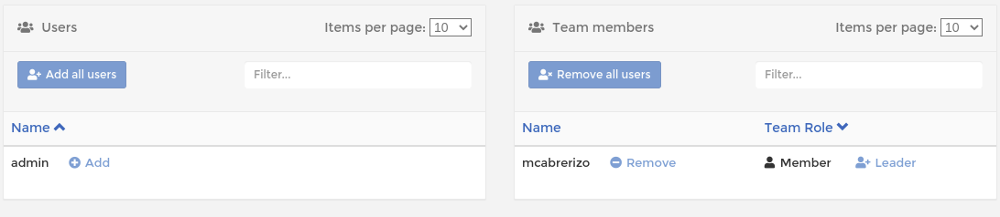
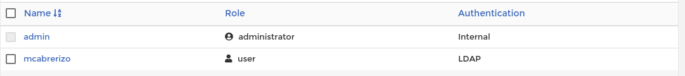
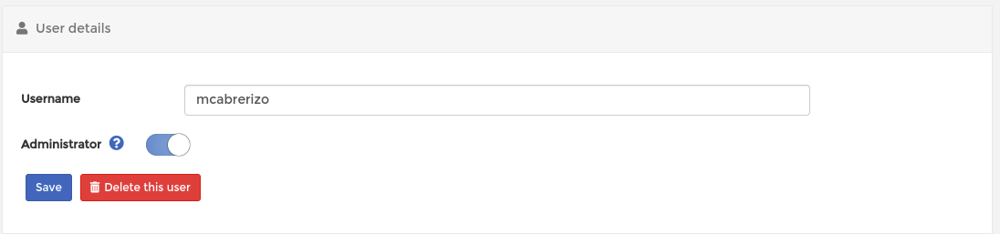

# Portainer Community Edition

This page shows how you can configure Portainer CE to authenticate users with Glim. [Portainer documentation](https://docs.portainer.io/admin/settings/authentication/ldap#ldap-security) explains you how to configure Portainer to use LDAP. Here we offer a full example with our suggestions to use Glim as an LDAP server.

First we'll visit the Settings -> Authentication menu in Portainer and click on LDAP to configure our LDAP server.



In our example, we'll use automatic user provisioning so Portainer creates users as soon as they can authenticate against our LDAP server.



We'll configure a Custom LDAP server.



Now we'll add our server's IP address or hostname and we'll use port 1636. We'll disable anonymous mode and add our readonly default account and the password (cn=search,dc=example,dc=org).



We'll use TLS but we'll skip verification of server certificate as there's a [bug in Portainer](https://github.com/portainer/portainer/issues/6271) preventing us to upload our CA certificate. We can also check connectivity with our server



OK. We'll set our Base DN and attribute for our User search



And, we'll also set our Base DN and attribute for our Group search



Finally we'll save our settings. Now, Glim can be used to authenticate your users.

Before testing if one of our Glim users can authenticate, I've created a team called "devel" as I want Portainer to assign this user to that team as it's a member of that Glim group.

OK. I can log in Portainer with my Glim user.


Now I log in again with my admin user and check that my user is already a member of the "devel" group.



Also I can see my user in my Users view and I can change its role to Administrator





Sample log showing successful authentication, user information retrieval, getting groups...:

```(text)
2022-07-03T12:34:38+02:00 [LDAP] ⇨ serving LDAPS connection from 172.17.0.4:51210
2022-07-03T12:34:38+02:00 [LDAP] ⇨ bind requested by client: 172.17.0.4:51210
2022-07-03T12:34:38+02:00 [LDAP] ⇨ bind protocol version: 3 client 172.17.0.4:51210
2022-07-03T12:34:38+02:00 [LDAP] ⇨ bind name: cn=search,dc=example,dc=org client 172.17.0.4:51210
2022-07-03T12:34:38+02:00 [LDAP] ⇨ bind password: ********** client 172.17.0.4:51210
2022-07-03T12:34:38+02:00 [LDAP] ⇨ success: valid credentials provided
2022-07-03T12:34:38+02:00 [LDAP] ⇨ search requested by client 172.17.0.4:51210
2022-07-03T12:34:38+02:00 [LDAP] ⇨ search base object: ou=Users,dc=example,dc=org
2022-07-03T12:34:38+02:00 [LDAP] ⇨ search scope: wholeSubtree
2022-07-03T12:34:38+02:00 [LDAP] ⇨ search maximum number of entries to be returned (0 - No limit restriction): 0
2022-07-03T12:34:38+02:00 [LDAP] ⇨ search maximum time limit (0 - No limit restriction): 0
2022-07-03T12:34:38+02:00 [LDAP] ⇨ search show types only: false
2022-07-03T12:34:38+02:00 [LDAP] ⇨ search filter: (&(uid=mcabrerizo))
2022-07-03T12:34:38+02:00 [LDAP] ⇨ search attributes: dn
2022-07-03T12:34:38+02:00 [LDAP] ⇨ bind requested by client: 172.17.0.4:51210
2022-07-03T12:34:38+02:00 [LDAP] ⇨ bind protocol version: 3 client 172.17.0.4:51210
2022-07-03T12:34:38+02:00 [LDAP] ⇨ bind name: uid=mcabrerizo,ou=Users,dc=example,dc=org client 172.17.0.4:51210
2022-07-03T12:34:38+02:00 [LDAP] ⇨ bind password: ********** client 172.17.0.4:51210
2022-07-03T12:34:38+02:00 [LDAP] ⇨ success: valid credentials provided
2022-07-03T12:34:38+02:00 [LDAP] ⇨ connection closed by client 172.17.0.4:51210
2022-07-03T12:34:38+02:00 [LDAP] ⇨ serving LDAPS connection from 172.17.0.4:49808
2022-07-03T12:34:38+02:00 [LDAP] ⇨ bind requested by client: 172.17.0.4:49808
2022-07-03T12:34:38+02:00 [LDAP] ⇨ bind protocol version: 3 client 172.17.0.4:49808
2022-07-03T12:34:38+02:00 [LDAP] ⇨ bind name: cn=search,dc=example,dc=org client 172.17.0.4:49808
2022-07-03T12:34:38+02:00 [LDAP] ⇨ bind password: ********** client 172.17.0.4:49808
2022-07-03T12:34:38+02:00 [LDAP] ⇨ success: valid credentials provided
2022-07-03T12:34:38+02:00 [LDAP] ⇨ search requested by client 172.17.0.4:49808
2022-07-03T12:34:38+02:00 [LDAP] ⇨ search base object: ou=Users,dc=example,dc=org
2022-07-03T12:34:38+02:00 [LDAP] ⇨ search scope: wholeSubtree
2022-07-03T12:34:38+02:00 [LDAP] ⇨ search maximum number of entries to be returned (0 - No limit restriction): 0
2022-07-03T12:34:38+02:00 [LDAP] ⇨ search maximum time limit (0 - No limit restriction): 0
2022-07-03T12:34:38+02:00 [LDAP] ⇨ search show types only: false
2022-07-03T12:34:38+02:00 [LDAP] ⇨ search filter: (&(uid=mcabrerizo))
2022-07-03T12:34:38+02:00 [LDAP] ⇨ search attributes: dn
2022-07-03T12:34:38+02:00 [LDAP] ⇨ search requested by client 172.17.0.4:49808
2022-07-03T12:34:38+02:00 [LDAP] ⇨ search base object: ou=Groups,dc=example,dc=org
2022-07-03T12:34:38+02:00 [LDAP] ⇨ search scope: wholeSubtree
2022-07-03T12:34:38+02:00 [LDAP] ⇨ search maximum number of entries to be returned (0 - No limit restriction): 0
2022-07-03T12:34:38+02:00 [LDAP] ⇨ search maximum time limit (0 - No limit restriction): 0
2022-07-03T12:34:38+02:00 [LDAP] ⇨ search show types only: false
2022-07-03T12:34:38+02:00 [LDAP] ⇨ search filter: (&(member=uid=mcabrerizo,ou=Users,dc=example,dc=org))
2022-07-03T12:34:38+02:00 [LDAP] ⇨ search attributes: cn
2022-07-03T12:34:38+02:00 [LDAP] ⇨ connection closed by client 172.17.0.4:49808
```
