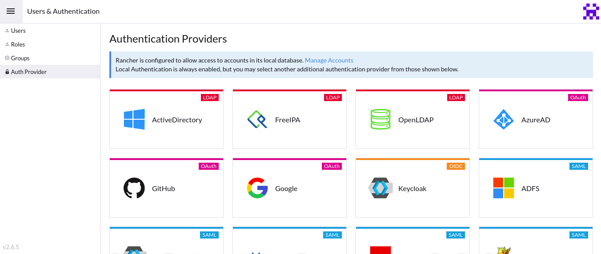
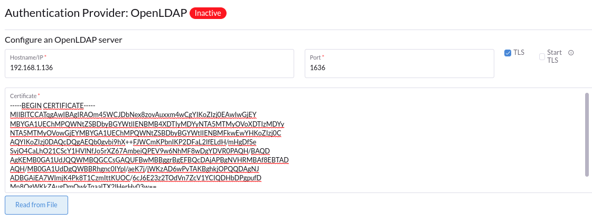
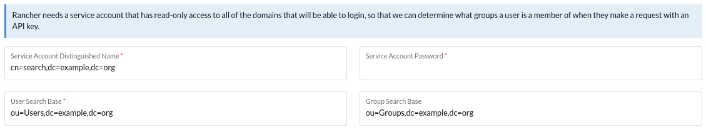
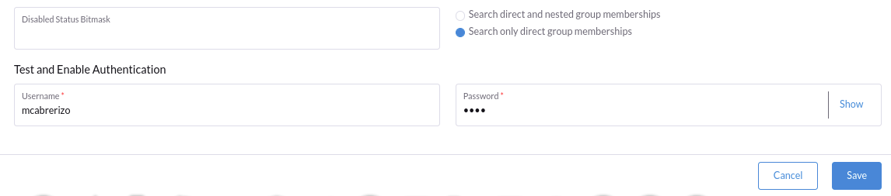
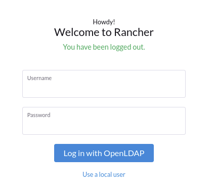

# Rancher

This page shows how you can configure Rancher to authenticate users with Glim. [Rancher documentation](https://rancher.com/docs/rancher/v2.5/en/admin-settings/authentication/openldap/openldap-config/) explains you how to configure Rancher to use OpenLDAP. Here we offer a full example with our suggestions to use Glim instead.

First we'll visit the User & Authentication settings in Rancher and select OpenLDAP



Then, we'll start providing the hostname and port (1636), check TLS and add your CA certificate pem file (public certificate).



Now, we'll provide our readonly service account information and its password. Glim creates a readonly account that you can use to search for information. Also we add the following base strings for user search base and group search base.



Finally, we'll test authentication using the username and password of the Glim account that will become the administrator.



Once we click Save if we're successful we'll see the following message:


Also, by default, any valid user in Glim will be allowed to log in Rancher.


Now, Glim can be used to authenticate your users as if it was an OpenLDAP server.



Sample log showing successful authentication, user information retrieval, getting groups...:

```(text)
2022-06-26T12:02:16+02:00 [LDAP] ⇨ bind requested by client: 192.168.1.136:55056
2022-06-26T12:02:16+02:00 [LDAP] ⇨ bind protocol version: 3 client 192.168.1.136:55056
2022-06-26T12:02:16+02:00 [LDAP] ⇨ bind name: cn=search,dc=example,dc=org client 192.168.1.136:55056
2022-06-26T12:02:16+02:00 [LDAP] ⇨ bind password: ********** client 192.168.1.136:55056
2022-06-26T12:02:16+02:00 [LDAP] ⇨ success: valid credentials provided
2022-06-26T12:02:16+02:00 [LDAP] ⇨ search requested by client 192.168.1.136:55056
2022-06-26T12:02:16+02:00 [LDAP] ⇨ search base object: ou=Groups,dc=example,dc=org
2022-06-26T12:02:16+02:00 [LDAP] ⇨ search scope: wholeSubtree
2022-06-26T12:02:16+02:00 [LDAP] ⇨ search maximum number of entries to be returned (0 - No limit restriction): 0
2022-06-26T12:02:16+02:00 [LDAP] ⇨ search maximum time limit (0 - No limit restriction): 0
2022-06-26T12:02:16+02:00 [LDAP] ⇨ search show types only: false
2022-06-26T12:02:16+02:00 [LDAP] ⇨ search filter: (&(objectClass=groupOfNames)(|(entryDN=cn=devel,ou=Groups,dc=example,dc=org)(entryDN=cn=gitea-admins,ou=Groups,dc=example,dc=org)))
2022-06-26T12:02:16+02:00 [LDAP] ⇨ search attributes: entryDN objectClass groupOfNames uid cn cn
2022-06-26T12:02:16+02:00 [LDAP] ⇨ unbind requested by client: 192.168.1.136:55056
2022-06-26T12:02:16+02:00 [LDAP] ⇨ connection closed by client 192.168.1.136:55056
2022-06-26T12:02:31+02:00 [LDAP] ⇨ serving LDAPS connection from 172.17.0.3:59420
2022-06-26T12:02:31+02:00 [LDAP] ⇨ bind requested by client: 172.17.0.3:59420
2022-06-26T12:02:31+02:00 [LDAP] ⇨ bind protocol version: 3 client 172.17.0.3:59420
2022-06-26T12:02:31+02:00 [LDAP] ⇨ bind name: cn=search,dc=example,dc=org client 172.17.0.3:59420
2022-06-26T12:02:31+02:00 [LDAP] ⇨ bind password: ********** client 172.17.0.3:59420
2022-06-26T12:02:31+02:00 [LDAP] ⇨ success: valid credentials provided
2022-06-26T12:02:31+02:00 [LDAP] ⇨ search requested by client 172.17.0.3:59420
2022-06-26T12:02:31+02:00 [LDAP] ⇨ search base object: ou=Users,dc=example,dc=org
2022-06-26T12:02:31+02:00 [LDAP] ⇨ search scope: wholeSubtree
2022-06-26T12:02:31+02:00 [LDAP] ⇨ search maximum number of entries to be returned (0 - No limit restriction): 0
2022-06-26T12:02:31+02:00 [LDAP] ⇨ search maximum time limit (0 - No limit restriction): 0
2022-06-26T12:02:31+02:00 [LDAP] ⇨ search show types only: false
2022-06-26T12:02:31+02:00 [LDAP] ⇨ search filter: (&(objectClass=inetOrgPerson)(uid=mcabrerizo))
2022-06-26T12:02:31+02:00 [LDAP] ⇨ search attributes: dn memberOf objectClass inetOrgPerson uid cn 
2022-06-26T12:02:31+02:00 [LDAP] ⇨ bind requested by client: 172.17.0.3:59420
2022-06-26T12:02:31+02:00 [LDAP] ⇨ bind protocol version: 3 client 172.17.0.3:59420
2022-06-26T12:02:31+02:00 [LDAP] ⇨ bind name: uid=mcabrerizo,ou=Users,dc=example,dc=org client 172.17.0.3:59420
2022-06-26T12:02:31+02:00 [LDAP] ⇨ bind password: ********** client 172.17.0.3:59420
2022-06-26T12:02:31+02:00 [LDAP] ⇨ success: valid credentials provided
2022-06-26T12:02:31+02:00 [LDAP] ⇨ search requested by client 172.17.0.3:59420
2022-06-26T12:02:31+02:00 [LDAP] ⇨ search base object: uid=mcabrerizo,ou=Users,dc=example,dc=org
2022-06-26T12:02:31+02:00 [LDAP] ⇨ search scope: wholeSubtree
2022-06-26T12:02:31+02:00 [LDAP] ⇨ search maximum number of entries to be returned (0 - No limit restriction): 0
2022-06-26T12:02:31+02:00 [LDAP] ⇨ search maximum time limit (0 - No limit restriction): 0
2022-06-26T12:02:31+02:00 [LDAP] ⇨ search show types only: false
2022-06-26T12:02:31+02:00 [LDAP] ⇨ search filter: (objectClass=inetOrgPerson)
2022-06-26T12:02:31+02:00 [LDAP] ⇨ search attributes: 1.1 + *
2022-06-26T12:02:31+02:00 [LDAP] ⇨ bind requested by client: 172.17.0.3:59420
2022-06-26T12:02:31+02:00 [LDAP] ⇨ bind protocol version: 3 client 172.17.0.3:59420
2022-06-26T12:02:31+02:00 [LDAP] ⇨ bind name: cn=search,dc=example,dc=org client 172.17.0.3:59420
2022-06-26T12:02:31+02:00 [LDAP] ⇨ bind password: ********** client 172.17.0.3:59420
2022-06-26T12:02:31+02:00 [LDAP] ⇨ success: valid credentials provided
2022-06-26T12:02:31+02:00 [LDAP] ⇨ search requested by client 172.17.0.3:59420
2022-06-26T12:02:31+02:00 [LDAP] ⇨ search base object: ou=Groups,dc=example,dc=org
2022-06-26T12:02:31+02:00 [LDAP] ⇨ search scope: wholeSubtree
2022-06-26T12:02:31+02:00 [LDAP] ⇨ search maximum number of entries to be returned (0 - No limit restriction): 0
2022-06-26T12:02:31+02:00 [LDAP] ⇨ search maximum time limit (0 - No limit restriction): 0
2022-06-26T12:02:31+02:00 [LDAP] ⇨ search show types only: false
2022-06-26T12:02:31+02:00 [LDAP] ⇨ search filter: (&(objectClass=groupOfNames)(|(entryDN=cn=devel,ou=Groups,dc=example,dc=org)(entryDN=cn=gitea-admins,ou=Groups,dc=example,dc=org)))
2022-06-26T12:02:31+02:00 [LDAP] ⇨ search attributes: entryDN objectClass groupOfNames uid cn cn
2022-06-26T12:02:31+02:00 [LDAP] ⇨ bind requested by client: 172.17.0.3:59420
2022-06-26T12:02:31+02:00 [LDAP] ⇨ bind protocol version: 3 client 172.17.0.3:59420
2022-06-26T12:02:31+02:00 [LDAP] ⇨ bind name: cn=search,dc=example,dc=org client 172.17.0.3:59420
2022-06-26T12:02:31+02:00 [LDAP] ⇨ bind password: ********** client 172.17.0.3:59420
2022-06-26T12:02:31+02:00 [LDAP] ⇨ success: valid credentials provided
2022-06-26T12:02:31+02:00 [LDAP] ⇨ search requested by client 172.17.0.3:59420
2022-06-26T12:02:31+02:00 [LDAP] ⇨ search base object: ou=Groups,dc=example,dc=org
2022-06-26T12:02:31+02:00 [LDAP] ⇨ search scope: wholeSubtree
2022-06-26T12:02:31+02:00 [LDAP] ⇨ search maximum number of entries to be returned (0 - No limit restriction): 0
2022-06-26T12:02:31+02:00 [LDAP] ⇨ search maximum time limit (0 - No limit restriction): 0
2022-06-26T12:02:31+02:00 [LDAP] ⇨ search show types only: false
2022-06-26T12:02:31+02:00 [LDAP] ⇨ search filter: (&(member=uid=mcabrerizo,ou=Users,dc=example,dc=org)(objectClass=groupOfNames))
2022-06-26T12:02:31+02:00 [LDAP] ⇨ search attributes: entryDN objectClass groupOfNames uid cn cn
2022-06-26T12:02:31+02:00 [LDAP] ⇨ connection closed by client 172.17.0.3:59420
```
